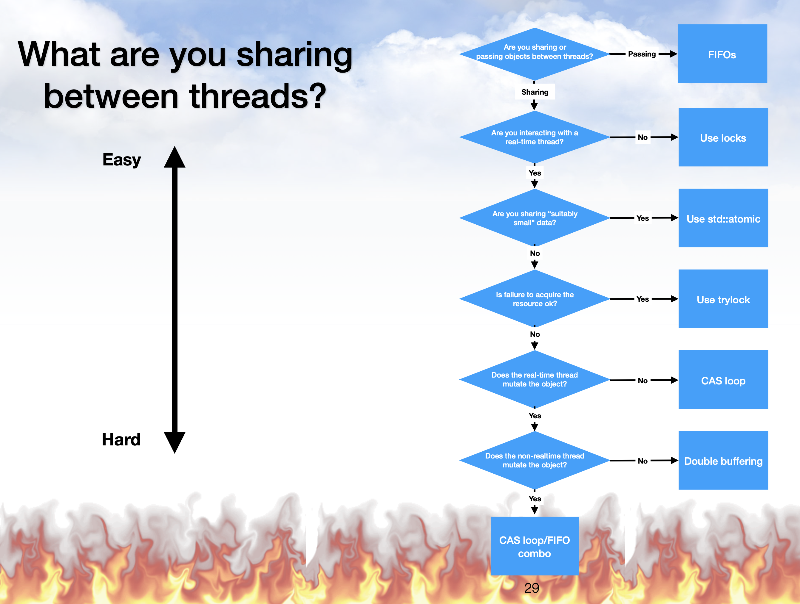

# haslo's Plugin References

Just a collection of things I use for reference while developing plugins.

## Libraries

### FFT

* [FFTW](https://www.fftw.org/) - GPL!
* [pffft](https://bitbucket.org/jpommier/pffft/src/master/)

## Links, Papers, Talks, Books

### Generic Plugin Dev & DSP

* Book, [Designing Software Synthesizer Plugins in C++](https://www.willpirkle.com/synthbook/) (Will C. Pirkle)
* Book, [Designing Audio Effect Plugins in C++](https://www.willpirkle.com/fx-book/) (Will C. Pirkle)
* Book, [Signals, Sound and Sensation](https://web.pa.msu.edu/acoustics/ssands.htm) (William M. Hartmann)
* Book, [DAFX - Digital Audio Effects](https://dafx.de/DAFX_Book_Page_2nd_edition/index.html) (edited by Udo Zölzer)
* Book, [Sound Synthesis for Music Reproduction and Performance](https://winntbg.bg.agh.edu.pl/skrypty4/0612/) (Marek Pluta)

### C++ and JUCE structure

* Talk [CMake For The Uninitiated](https://www.youtube.com/watch?v=8kF0Ea2VuXA) (Eyal Amir) - [repository](https://github.com/eyalamirmusic/JUCECmakeRepoPrototype)

### C++ and Realtime

* Talk, **C++ in the Audio Industry** (Timur Doumler)
  * [Part I at CppCon](https://www.youtube.com/watch?v=boPEO2auJj4) (CppCon 2015) - [slides](https://github.com/CppCon/CppCon2015/tree/master/Presentations/C%2B%2B%20In%20the%20Audio%20Industry)
  * [Part II at JUCE Summit](https://www.youtube.com/watch?v=2vmXy7znEzs) (JUCE Summit 2015)
* Talk, **Real-time 101** (Fabian Renn-Giles & Dave Rowland, ADC 2019) - [slides (both parts)](https://github.com/drowaudio/presentations/tree/master/ADC%202019%20-%20Real-time%20101)
  * [Part I: Investigating the real-time problem space](https://www.youtube.com/watch?v=Q0vrQFyAdWI)
  * [Part II: The real-time audio developer’s toolbox](https://www.youtube.com/watch?v=PoZAo2Vikbo)
* Talk, **atomic weapons** (Herb Sutter, C++ and Beyond 2012) - [blog post](https://herbsutter.com/2013/02/11/atomic-weapons-the-c-memory-model-and-modern-hardware/)
  * [Part I: Optimizations, races, and the memory model; acquire and release ordering](https://www.youtube.com/watch?v=A8eCGOqgvH4)
  * [Part II: Restrictions on compilers and hardware; code generation and performance; relaxed atomics; volatile](https://www.youtube.com/watch?v=KeLBd2EJLOU)
* Library, [farbot - FAbian's Realtime Box o' Tricks](https://github.com/hogliux/farbot) (Fabian Renn-Giles)
* Blog Posts by Ross Bencina:
  * [Real-time audio programming 101: time waits for nothing](http://www.rossbencina.com/code/real-time-audio-programming-101-time-waits-for-nothing)
  * [Some notes on lock-free and wait-free algorithms](http://www.rossbencina.com/code/lockfree)
* Talk, [Real-time Confessions in C++](https://www.youtube.com/watch?v=JG7lqt7V1uY) (Fabian Renn-Giles, ADC23)

### Distortion

* Paper, [Reducing Aliasing of Waveshaping Using Convolution](https://dafx16.vutbr.cz/dafxpapers/20-DAFx-16_paper_41-PN.pdf) (Native Instruments)
* Paper, [Alias Suppression in Digital Distortion](https://vicanek.de/articles/AADistortion.pdf) (Martin Vicanek)
* Paper, [Waveshaper Harmonics](https://vicanek.de/articles/WaveshaperHarmonix.pdf) (Martin Vicanek)

### Physical Modelling

* Paper, [The bowed string and its playability](https://escholarship.mcgill.ca/downloads/q811kn41m.pdf) (Hossein Mansour)
* Paper, [On the synthesis of guitar plucks](https://www.researchgate.net/publication/228935188_On_the_synthesis_of_guitar_plucks) (Jim Woodhouse)
* Paper, [Guitar with Collision Simulation](https://www.researchgate.net/publication/346562874_Guitar_Virtual_Instrument_using_Physical_Modelling_with_Collision_Simulation) (Chuck-jee Chau) - [prototype website](https://weonix.github.io/Physical-Guitar-ICMC-Demo/)
* Book, [Physical Audio Signal Processing](https://ccrma.stanford.edu/~jos/pasp/) (Julius O. Smith)
* Talk, [Sound synthesis based on physical models](https://www.youtube.com/watch?v=dUcNzPhZdwk) (Julius O. Smith, CIRMMT 2010) - [slides](https://www.cirmmt.org/en/events/distinguished-lectures/smith-slides)
* Talk, [Physical modelling of guitar strings](https://www.youtube.com/watch?v=sxt5rxF_PdI) (Martin Shuppius, ADC 2017)

### Business

* Talk, [How to Make a Successful Plugin From Scratch](https://www.youtube.com/watch?v=4TtpQn1ovaE) (Marius Metzger, ADC23) - [slides](https://docs.google.com/presentation/d/1oIM33u4huTFny9GasHak4yOwFd-gShP2aNkeGExGFMg/edit#slide=id.p)

### Conferences

* Conference, [DAFX](https://dafx.de/)

### Link Collections

* [Resources recommended for learning audio programming](https://thewolfsound.com/resources/) (WolfSound)

## The Flowchart

